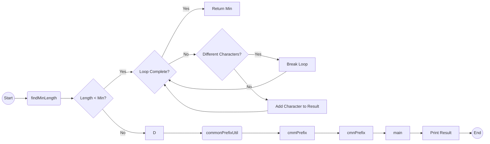

```mermaid
graph LR

A((Start)) --> B(findMinLength)
B --> C{Length < Min?}
C -- No --> D
C -- Yes --> E{Loop Complete?}
E -- Yes --> F[Return Min]
E -- No --> G{Different Characters?}
G -- Yes --> H[Break Loop]
G -- No --> I[Add Character to Result]
H --> E
I --> E
D --> J(commonPrefixUtil)
J --> K[cmmPrefix]
K --> L[cmnPrefix]
L --> M[main]
M --> N[Print Result]
N --> O((End))
```