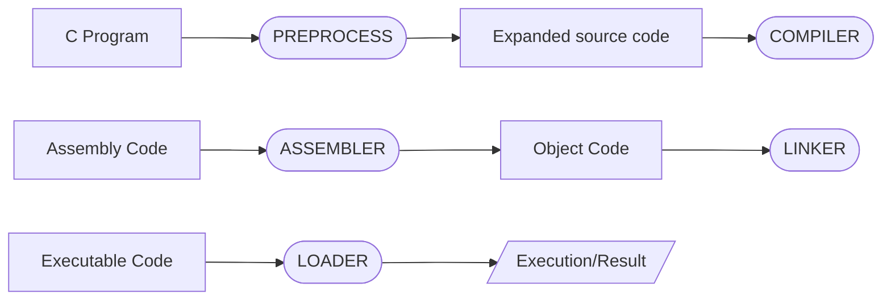

**[[C|HOME [C]]]**

---
# Flow of C program

1. C program (**source code**) is sent ➡  to [[C#^preprocess|preprocessor]] first.
	- The **preprocessor** is responsible to convert preprocessor directives into their respective values.
	- It generates an expanded source code.
2. Expanded source code is sent to ➡ **compiler** which compiles the code and converts it into assembly code.
3. The **assembly code** is sent to assembler which assembles the code and converts it into object code.
	- Now a **simble.obj** file is generated
4. The **object code** is sent to ➡ to linker which links it to the library such as header files.
	- Then it is converted into executable code.
	- A **simple.exe** file is generated.
5. The **executable code** is sent to ➡ to loader which loads it into memory and then it is executed.
	- After execution, output is sent to console.

# 

 

---
**Sources:**
- [Flow of C Program](https://www.javatpoint.com/flow-of-c-program)
- [Mermaid syntax](https://mermaid-js.github.io/mermaid/#/flowchart?id=flowchart-orientation)